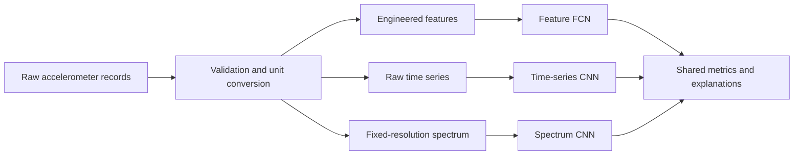

# Physics-Informed Vibration Regression

An end-to-end machine-learning pipeline for estimating two continuous operating parameters from accelerometer recordings. The project compares three representations under one shared validation and reporting protocol:

- physically interpretable time- and frequency-domain features with a fully connected network;
- raw 16,000-sample time series with a one-dimensional convolutional network;
- fixed-resolution amplitude spectra with a one-dimensional convolutional network.

The emphasis is not just prediction accuracy. The pipeline also tests data integrity, prevents preprocessing leakage, records reproducibility metadata, produces per-target metrics, and generates explanation artifacts for comparing what each model has learned.

## Why this project matters

Vibration signals encode several physical effects at once. Rotational frequency can be strongly informative for one target, while amplitude and distributional shape may carry more information about another. A single opaque model can hide that distinction. This project keeps three modelling paths comparable so that accuracy, robustness and physical plausibility can be judged together.



## Technical highlights

- two-output regression with target normalisation;
- preprocessing fitted on the training partition only;
- a shared train/validation split for fair model comparison;
- physics-aware fundamental-frequency extraction with harmonic safeguards;
- MAE, RMSE, R² and target-standard-deviation-normalised RMSE;
- target-specific feature and grouped input relevance analysis;
- saved run manifests, predictions, training histories and diagnostic plots.

## Repository layout

```text
src/
  DataAnalysis_Common.py       shared loading, splitting, training and metrics
  FeatureFCN_Analysis.py       engineered features and fully connected model
  TimeSeriesCNN_Analysis.py    raw-signal preparation and 1D CNN
  SpectrumNetwork_Analysis.py  spectral preparation and 1D CNN
  RunAll_Comparison.py         command-line entry point
data/                          local-only binary data; not included
outputs/                       generated artifacts; not versioned
models/                        trained Keras models from the showcased run
results/                       metrics, histories and diagnostic figures
```

## Published trained models

The repository includes three trained Keras models:

| Model | Input representation | Parameters | Validation mean normalised RMSE |
|---|---|---:|---:|
| `feature_fcn.keras` | 8 engineered vibration features | 850 | 0.252 |
| `time_cnn.keras` | raw 16,000-sample time series | 29,922 | 0.208 |
| `spectrum_cnn.keras` | 0–500 Hz fixed-resolution amplitude spectrum | 22,562 | 0.629 |

The raw-time CNN performed best on the showcased split. Its validation RMSE was 0.143 V for voltage and 1.459 cm for position. These values come from one seeded 80/20 split of 200 samples; they are evidence for this run, not a confidence interval or a guarantee on new hardware.

The saved networks expect the exact representation and training-fitted standardisation implemented in `src/`. A `.keras` file alone is not a safe end-to-end measurement system.

## Training evidence

`results/` retains the run seed and split summary, complete training histories, per-target training and validation metrics, loss curves, prediction and residual diagnostics, explanation figures and target-space split coverage.

The private raw dataset and hidden-test predictions remain excluded. The included evidence can therefore be audited without redistributing the source data or implying hidden-test accuracy.
## Data contract

The original dataset is not redistributed. To run the project, place locally authorised files in `data/` using these names:

| File | Expected content |
|---|---|
| `training_signals.bin` | 200 records × 16,000 signed 16-bit ADC samples |
| `testing_signals.bin` | 50 records × 16,000 signed 16-bit ADC samples |
| `training_targets.bin` | 200 pairs of 64-bit floating-point targets |

The acquisition assumptions used by the code are 1,600 Hz sampling, 10-second records, a ±2.048 V ADC range and 0.330 V/g accelerometer sensitivity. If your hardware or binary format differs, update the constants and loader before using the models.

## Quick start

Python 3.12 is recommended.

```powershell
python -m venv .venv
.\.venv\Scripts\python.exe -m pip install -r requirements.txt
.\.venv\Scripts\python.exe .\src\RunAll_Comparison.py --check-only
```

Run a short smoke test:

```powershell
.\.venv\Scripts\python.exe .\src\RunAll_Comparison.py --models feature --epochs 1 --patience 1 --output-dir .\outputs_smoke
```

Run the full comparison:

```powershell
.\.venv\Scripts\python.exe .\src\RunAll_Comparison.py --seed 53
```

Use an explicit seed for a reproducible split. Omitting `--seed` intentionally creates a fresh seed and prints it for later reuse.

## Scope and limitations

- The private source dataset, teaching materials, assessment documents and full report are intentionally excluded.
- Trained weights and selected training/validation evidence are included.
- Hidden-test predictions cannot support accuracy claims without labels.
- Model performance is dataset-specific; the pipeline is not a calibrated condition-monitoring product.
- Public visibility is for portfolio review; it is not an invitation to submit this work for academic credit.

## Licence

Copyright © 2026 Edmund Dai. All rights reserved.

The repository is publicly viewable, but no permission is granted to copy, modify, redistribute or submit this work as academic work. A formal open-source licence can be added later if broader reuse is intended.
