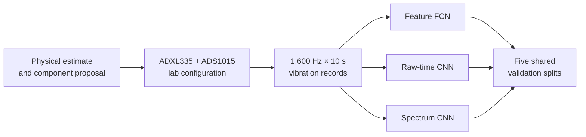

# Vibration Measurement to Neural Network Analysis

An engineering case study tracing a rotating-beam vibration problem from early sensor and ADC estimates through laboratory acquisition, signal processing, model selection and repeated validation.

The [first acquisition design](docs/01-first-acquisition-design.md) explains the original physical estimate and component proposal. The [lab acquisition report](docs/02-lab-acquisition-and-validation.md) records how the design changed with the supplied hardware and measured signal. The [model-selection report](docs/03-model-selection-and-stability.md) follows the later supplied data through a feature network, a raw-time CNN and a spectrum CNN.

## Read the project in order

1. [Initial measurement design](docs/01-first-acquisition-design.md): rotating-unbalance model, proposed sensor, range and sampling requirements.
2. [ADC and sampling decisions](docs/02-lab-acquisition-and-validation.md): differential ADS1015 input, ±2.048 V range, 0.01 µF filter, 1,600 samples/s, 10 s records and lab checks.
3. [Models and stable evidence](docs/03-model-selection-and-stability.md): conversions, three input representations, five shared validation splits, controlled design choices and limitations.
4. [Evidence and experiment configurations](evidence/README.md): summary CSVs and selected figures linked to the claims.



## What the final comparison found

The later modelling study used **200 labelled records**, five fixed target-aware 80/20 splits and training-only normalisation. The table reports mean ± standard deviation over those splits; it is not accuracy on the 50 unlabelled test records.

| Method | Mean normalised RMSE | Voltage RMSE | Position RMSE |
|---|---:|---:|---:|
| Seven-feature FCN, 818 parameters | **0.208 ± 0.015** | **0.126 ± 0.009 V** | 1.514 ± 0.169 cm |
| Raw-time CNN, 29,922 parameters | 0.209 ± 0.042 | 0.176 ± 0.038 V | **1.305 ± 0.322 cm** |
| Spectrum CNN, 22,562 parameters | 0.582 ± 0.062 | 0.509 ± 0.069 V | 3.555 ± 0.351 cm |

The compact feature model is the primary choice for the joint task. The time CNN is preferable when position accuracy is the priority. A simulated +5% held-out sensor-gain change increased mean normalised RMSE by 0.0057 for the time CNN and 0.0189 for the feature model; this is evidence about one tested perturbation, not deployment reliability.

## Repository map

```text
docs/         public editions of the measurement and model reports
src/          final analysis and repeated-study code
experiments/  declared model-selection and validation configurations
evidence/     summary metrics, selected figures and stress-test results
archive/      earlier single-split trained Keras files and plots
```

The three Keras files under [the archive](archive/initial-single-split/) belong to an **earlier single-split run**. They are kept as historical trained artifacts. They are not the five-split models behind the table above; those experiments produced one fitted model per split and did not designate a single exported final weight file.

## Reproducing the analysis

Python 3.12 and the packages in [requirements.txt](requirements.txt) were used. The original course-supplied binary data are not redistributed. With locally authorised data, place the following files in `data/`:

| File | Expected shape and type |
|---|---|
| `training_signals.bin` | 200 × 16,000 signed 16-bit ADC counts |
| `testing_signals.bin` | 50 × 16,000 signed 16-bit ADC counts |
| `training_targets.bin` | 200 pairs of 64-bit floating-point targets |

```powershell
python -m venv .venv
.\.venv\Scripts\python.exe -m pip install -r requirements.txt
.\.venv\Scripts\python.exe .\src\RunReportStudies.py --config .\experiments\final_feature.json --check-only
.\.venv\Scripts\python.exe .\src\RunReportStudies.py --config .\experiments\final_feature.json
```

The time and spectrum configurations can be run by changing `--config` to `final_time.json` or `final_spectrum.json`. Each real run writes a new timestamped folder beneath `outputs/studies/`. The published CSVs document the original runs; numerical equality across hardware and library versions is not guaranteed.

## Provenance and scope

The initial measurement design and final data-analysis report were individual work by Edmund Dai. The laboratory acquisition report was a five-person Group 15 project; the public acquisition document adapts Edmund's parameter-selection contribution and attributes the group's validation observations. The full group report, other students' identifiers, course handouts, original signals and hidden-test predictions are not included.

The first physical estimate and later laboratory observations differ, and the later 200-record analysis uses a separately supplied dataset with its own stated accelerometer sensitivity. Those changes are documented rather than hidden.

Copyright © 2026 Edmund Dai. All rights reserved. Public visibility does not grant permission to reuse the work for an academic submission.
