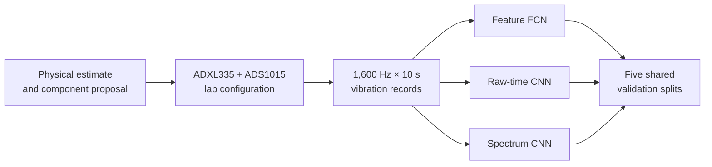

# Vibration Measurement to Neural Network Analysis

An engineering case study tracing a rotating-beam vibration problem from early sensor and ADC estimates through laboratory acquisition, signal processing, model selection and repeated validation.

The [first acquisition design](docs/01-first-acquisition-design.md) explains the original physical estimate and component proposal. The [lab acquisition report](docs/02-lab-acquisition-and-validation.md) records how the design changed with the supplied hardware and measured signal. The [model-selection report](docs/03-model-selection-and-stability.md) follows the later supplied data through a feature network, a raw-time CNN and a spectrum CNN.

## Read the project in order

1. [Initial measurement design](docs/01-first-acquisition-design.md): rotating-unbalance model, proposed sensor, range and sampling requirements.
2. [ADC and sampling decisions](docs/02-lab-acquisition-and-validation.md): differential ADS1015 input, ±2.048 V range, 0.01 µF filter, 1,600 samples/s, 10 s records and lab checks.
3. [Models and stable evidence](docs/03-model-selection-and-stability.md): conversions, three input representations, five shared validation splits, controlled design choices and limitations.
4. [Evidence and experiment configurations](evidence/README.md): summary CSVs and selected figures linked to the claims.



## Executive summary: adopted architectures and performance

The project estimates motor voltage and sensor position jointly from **200 labelled vibration records**. The architectures below are the choices adopted after bounded feature, architecture and noise comparisons; they are not claimed to be globally optimal.

| Adopted model | Optimised architecture | Parameters |
|---|---|---:|
| Feature FCN | Seven physical features, crest factor removed → Dense(32) → Dense(16) → two linear outputs; no training noise | 818 |
| Raw-time CNN | Full 16,000 samples → Conv1D 16/32/64, kernels 33/17/9, strides 4/2/2, local MaxPool(4) → global maximum → Dense(32) → two linear outputs; no training noise | 29,922 |
| Revised spectrum CNN | 5,001 log-amplitude bins → Conv1D 16/32/64, kernels 21/11/7, local MaxPool(4) → AveragePool(6) → Flatten (13 × 64) → Dense(32) → two linear outputs; training noise 0.01 | 47,138 |

The following means ± standard deviations use the original five target-aware 80/20 split assignments (seeds 53, 153, 253, 353 and 453). The feature-FCN result is retained from its original evaluation; raw-time and spectrum results were evaluated again in the readout study on those same assignments. These are validation metrics, not accuracy on the 50 unlabelled test records.

| Selected model | Mean normalised RMSE | Voltage RMSE | Position RMSE |
|---|---:|---:|---:|
| Seven-feature FCN | **0.208 ± 0.015** | **0.126 ± 0.009 V** | 1.514 ± 0.169 cm |
| Raw-time CNN, re-evaluated | 0.213 ± 0.040 | 0.182 ± 0.037 V | **1.315 ± 0.310 cm** |
| Revised spectrum CNN | 0.265 ± 0.034 | 0.246 ± 0.062 V | 1.555 ± 0.078 cm |

The selected spectrum readout was then frozen and compared with the original architecture, a larger capacity control and the raw-time reference on **five new split assignments** (1053, 1153, 1253, 1353 and 1453):

| Frozen model / control | Parameters | Mean normalised RMSE | Voltage RMSE | Position RMSE |
|---|---:|---:|---:|---:|
| Historical global-average spectrum | 22,562 | 0.590 ± 0.071 | 0.506 ± 0.057 V | 3.632 ± 0.499 cm |
| Wide global-average spectrum | 180,280 | 0.547 ± 0.030 | 0.468 ± 0.032 V | 3.369 ± 0.194 cm |
| Revised band-aggregation spectrum | 47,138 | 0.252 ± 0.023 | 0.242 ± 0.030 V | **1.434 ± 0.124 cm** |
| Matched raw-time reference | 29,922 | **0.230 ± 0.030** | **0.181 ± 0.026 V** | 1.487 ± 0.227 cm |

Keeping the same amplitude-spectrum input, ordered band aggregation reduced confirmation mean normalised RMSE by **57.4%** relative to global averaging and improved both targets on all five paired splits. The much larger global-average control remained weak, supporting loss of explicit frequency location as an important architectural bottleneck. Missing phase is not an established explanation for the historical failure, and pooling is not proven to be its sole cause.

The revised spectrum model approached raw-time position accuracy: its mean position error was 3.6% lower, with only **three of five** paired wins. Voltage error was 33.2% higher and joint error 9.4% higher, so it did **not** meet the declared 5% overall-parity tolerance. The seven-feature FCN remains the compact primary recommendation for voltage accuracy and model size; raw-time CNN remains the stronger overall CNN. Band aggregation is now a credible position alternative.

The split assignments reuse the same 200 records, and validation also controls early stopping. Confirmation therefore checks stability rather than independent external-test accuracy or statistical significance. Earlier gain and frequency-band explanation results apply to the historical global-average spectrum model only; revised-model robustness and explainability remain untested.

## Repository map

```text
docs/         public editions of the measurement and model reports
src/          final analysis and repeated-study code
experiments/  declared model-selection and validation configurations
evidence/     summary metrics, selected figures and stress-test results
models/       representative revised spectrum model and preprocessing scales
archive/      earlier single-split trained Keras files and plots
```

The three Keras files under [the archive](archive/initial-single-split/) belong to an **earlier single-split run**. They are kept as historical trained artifacts. They are not the five-split models behind the table above; those experiments produced one fitted model per split and did not designate a single exported final weight file.

## Reproducing the analysis

Python 3.12 and the packages in [requirements.txt](requirements.txt) were used. The original course-supplied binary data are not redistributed. With locally authorised data, place the following files in `data/`:

| File | Expected shape and type |
|---|---|
| `training_signals.bin` | 200 × 16,000 signed 16-bit ADC counts |
| `testing_signals.bin` | 50 × 16,000 signed 16-bit ADC counts |
| `training_targets.bin` | 200 pairs of 64-bit floating-point targets |

```powershell
python -m venv .venv
.\.venv\Scripts\python.exe -m pip install -r requirements.txt
.\.venv\Scripts\python.exe .\src\RunReportStudies.py --config .\experiments\final_feature.json --check-only
.\.venv\Scripts\python.exe .\src\RunReportStudies.py --config .\experiments\final_feature.json
```

The time and spectrum configurations can be run by changing `--config` to `final_time.json` or `final_spectrum.json` (the revised band-aggregation model). The three `spectrum_position_*_study.json` configurations reproduce the readout selection, capacity check and frozen confirmation stages. Each real run writes a new timestamped folder beneath `outputs/studies/`. Run `python src/VerifySpectrumReadouts.py` to check all eight readouts, matched initial backbones, position retention and save/reload agreement. The [representative revised model](models/spectrum-band/) includes its fitted preprocessing scales. The published CSVs document the original runs; numerical equality across hardware and library versions is not guaranteed.

## Provenance and scope

The initial measurement design and final data-analysis report were individual work by Edmund Dai. The laboratory acquisition report was a five-person Group 15 project; the public acquisition document adapts Edmund's parameter-selection contribution and attributes the group's validation observations. The full group report, other students' identifiers, course handouts, original signals and hidden-test predictions are not included.

The first physical estimate and later laboratory observations differ, and the later 200-record analysis uses a separately supplied dataset with its own stated accelerometer sensitivity. Those changes are documented rather than hidden.

Copyright © 2026 Edmund Dai. All rights reserved. Public visibility does not grant permission to reuse the work for an academic submission.
