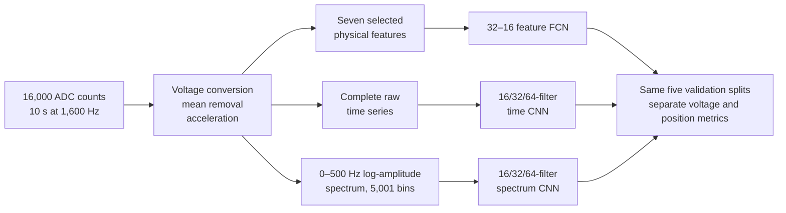
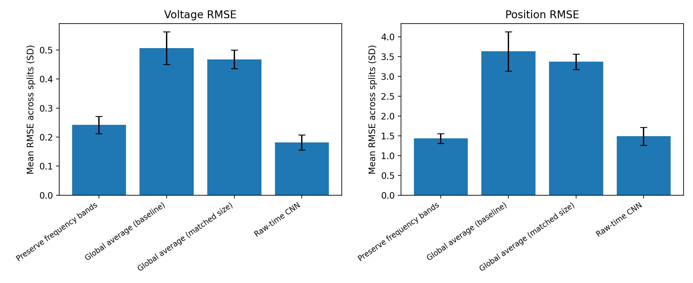

# From sampled vibration to validated predictions

The acquisition choices in the [first design](01-first-acquisition-design.md) and [lab validation](02-lab-acquisition-and-validation.md) explain why each supplied record has 16,000 ADC counts sampled at 1,600 Hz. This report follows those records through data checks, feature construction, network selection and repeated validation. The analysis used a **separately supplied** 200-record labelled dataset and 50 unlabelled test records. It does not claim that the earlier single lab trace and the later 200 records are the same experiment.

## 1. Convert and check the measurement

The assigned data are signed 16-bit containers for the ADS1015's 12-bit output at ±2.048 V. The conversion is approximately 0.001 V/count. Each record is mean-centred and converted to acceleration using **0.330 V/g, as specified for the later assignment**. The acquisition report used a typical 0.300 V/g value when discussing its earlier lab trace; that value is not silently carried into this analysis.

The 200 labelled records were checked for shape, finite values and ADC bounds. The observed counts stayed within the selected ADC range. The maximum mean-centred acceleration reached about 5.79 g, which reinforces the warning that the first report's 1.6 g estimate was not a reliable bound.

The working hypothesis was that motor voltage influences rotational speed, which appears in dominant frequency, while sensor position changes the measured response amplitude and waveform. It motivated the candidate features and the use of a raw-signal CNN, but the later feature-importance and model comparisons measure predictive associations rather than mechanical causation.

## 2. Keep three input representations comparable

The feature path computes RMS, peak-to-peak amplitude, kurtosis, a declared 20–105 Hz band peak and its amplitude, high-frequency energy ratio and spectral centroid. Crest factor was tested and removed. The raw-time CNN sees the whole mean-centred record without an FFT or engineered features. The spectrum CNN sees a one-sided, fixed 0.1 Hz grid from 0 to 500 Hz after `log1p` amplitude compression; frequency coordinates label plots but are not separate network inputs.

The largest 20–105 Hz peak correlated strongly with voltage in the supplied data. An earlier rule that automatically halved apparent second-harmonic peaks was rejected after an audit showed worse consistency on the three altered records. The retained rule is a reproducible *feature definition*, not independent proof of the mechanical fundamental.

## 3. Compare choices before selecting models

Only 200 labelled examples were available, so each choice was checked on the **same five target-aware 80/20 splits**, with seeds 53, 153, 253, 353 and 453. Every input and target standardiser was fitted on the 160 training records of each split and then applied unchanged to its 40 validation records. The hidden-label test set was not used to calculate accuracy.

| Decision | Compared alternatives | Evidence-based choice |
|---|---|---|
| Feature set | Eight candidates and ablations | Remove crest factor; mean normalised RMSE fell from 0.226 to 0.208. Removing dominant frequency raised it to 0.442. |
| Feature network size | 8–8, 32–16 and 64–32 hidden widths | Select 32–16 and 818 parameters. The 64–32 model was marginally lower at 0.202 versus 0.208 but used 2,658 parameters. |
| Time CNN sampling reduction | Aggressive versus gentler convolution/pooling | Aggressive path: 0.209 mean normalised RMSE versus 0.224 for the gentler path. |
| Time CNN training noise | Standard deviations 0, 0.01 and 0.02 | Select zero. Noise 0.01 slightly lowered the overall average but worsened voltage RMSE. |
| Historical spectrum global pooling | Average versus maximum | Average pooling: 0.592 mean normalised RMSE versus 0.691 for maximum under the matched no-noise control. |
| Historical spectrum training noise | Standard deviations 0, 0.01 and 0.02 | Select 0.01: 0.582 mean normalised RMSE; small gain relative to split variation. |

The later readout study held the spectrum input, convolutional backbone and noise 0.01 fixed, then compared five position-preserving candidates with global-average and raw-time controls. Band aggregation gave the lowest selection mean normalised RMSE among those candidates (0.265), ahead of full flattening (0.281), and was frozen before new-split confirmation. Its ordered 13 × 64 responses preserve coarse frequency location. Across selection, capacity and confirmation stages, 60 model/split runs were completed.

These are bounded comparisons, not a global architecture search. The [published configurations](../experiments/) and [summary evidence](../evidence/) retain the decision trail.

## 4. Adopted architectures and repeated-validation results

| Adopted model | Optimised architecture | Parameters |
|---|---|---:|
| Feature FCN | Seven physical features, crest factor removed → Dense(32) → Dense(16) → two linear outputs; no training noise | 818 |
| Raw-time CNN | Full 16,000 samples → Conv1D 16/32/64, kernels 33/17/9, strides 4/2/2, local MaxPool(4) → global maximum → Dense(32) → two linear outputs; no training noise | 29,922 |
| Revised spectrum CNN | 5,001 log-amplitude bins → Conv1D 16/32/64, kernels 21/11/7, local MaxPool(4) → AveragePool(6) → Flatten (13 × 64) → Dense(32) → two linear outputs; training noise 0.01 | 47,138 |

The original five selection assignments support the three-model comparison below. Feature metrics are retained from the original feature evaluation; raw-time and revised spectrum metrics were evaluated again on those assignments in the readout study. The older raw-time study scored 0.209 ± 0.042 mean normalised RMSE, 0.176 ± 0.038 V and 1.305 ± 0.322 cm; those historical numbers remain in its original evidence files rather than being mixed into the updated table.

| Selected model | Mean normalised RMSE | Voltage RMSE | Position RMSE |
|---|---:|---:|---:|
| Seven-feature FCN | **0.208 ± 0.015** | **0.126 ± 0.009 V** | 1.514 ± 0.169 cm |
| Raw-time CNN, re-evaluated | 0.213 ± 0.040 | 0.182 ± 0.037 V | **1.315 ± 0.310 cm** |
| Revised spectrum CNN | 0.265 ± 0.034 | 0.246 ± 0.062 V | 1.555 ± 0.078 cm |

After freezing the band-aggregation candidate, five new split assignments (1053, 1153, 1253, 1353 and 1453) compared it with both global-average controls and a matched raw-time reference. Feature FCN was not rerun in this confirmation stage.

| Frozen model / control | Parameters | Mean normalised RMSE | Voltage RMSE | Position RMSE |
|---|---:|---:|---:|---:|
| Historical global-average spectrum | 22,562 | 0.590 ± 0.071 | 0.506 ± 0.057 V | 3.632 ± 0.499 cm |
| Wide global-average spectrum | 180,280 | 0.547 ± 0.030 | 0.468 ± 0.032 V | 3.369 ± 0.194 cm |
| Revised band-aggregation spectrum | 47,138 | 0.252 ± 0.023 | 0.242 ± 0.030 V | **1.434 ± 0.124 cm** |
| Matched raw-time reference | 29,922 | **0.230 ± 0.030** | **0.181 ± 0.026 V** | 1.487 ± 0.227 cm |

The revised spectrum model reduced mean normalised RMSE by 57.4% against the original global-average model, with both physical target errors improving on every paired split. A global-average model enlarged to 180,280 parameters remained weak. The input still contains the same 0–500 Hz amplitude spectrum, so loss of explicit frequency location during aggregation is supported as an important architectural bottleneck. Phase is discarded by amplitude spectra, but its absence has not been established as the cause of the historical failure; neither has pooling been proved the sole cause of the remaining gap.

Position RMSE was close to raw-time performance: 1.434 versus 1.487 cm, a 3.6% lower mean with only three of five paired wins. Voltage RMSE remained 33.2% higher, on all five splits, and joint error was 9.4% higher. Overall parity was not achieved under the declared 5% tolerance. The feature FCN remains the compact primary recommendation; raw-time CNN remains the stronger overall CNN; band aggregation is a credible position alternative.

The earlier shared stress test multiplied each held-out acceleration record by 1.05 after training. Mean normalised RMSE changed by +0.0189 for the feature FCN, +0.0057 for the time CNN and −0.0013 for the **historical global-average spectrum model**. The time CNN was more stable than the competitive feature model under this one simulated gain change. The historical spectrum result cannot be attributed to the revised readout, whose gain robustness and frequency-band explanation have not yet been evaluated.

## 5. What “stable output” means here

It means model choices were checked on five fixed, comparable selection splits, and the frozen spectrum candidate was additionally checked on five new shared splits; their mean errors and split-to-split variation were reported; architecture and augmentation choices were checked with matched controls; and a small calibration-shift test challenged the final selection. It does **not** mean that any one exported Keras file has been externally validated on a new sensor, motor or beam.

The original public repository snapshot contained three Keras files and plots from an earlier **single random split**. They are preserved in [the historical snapshot](../archive/initial-single-split/) with their original run seed. Those weights must not be confused with the final five-split estimates above. The repeated experiments saved metrics and predictions, not one canonical trained model file per method. A separate [representative revised spectrum model](../models/spectrum-band/) now includes its fitted preprocessing scales and verified save/reload behaviour. It used 160 training and 40 validation records and is not a fit on all 200 records. Repeated holdouts overlap and use validation for early stopping; new seeds are stability evidence, not an independent external test or a significance claim.

## Evidence and provenance

- [Feature selection and 818-parameter FCN](../evidence/feature-fcn/) — adopted row and ablations from the corrected 70-run study.
- [Raw-time CNN](../evidence/time-cnn/) — architecture control, noise control and final five-split metrics.
- [Historical spectrum CNN](../evidence/spectrum-cnn/) — old global-pooling/noise controls and model-specific explanation.
- [Revised spectrum readout](../evidence/spectrum-readout/) — selection, capacity control, frozen confirmation, per-split metrics and split assignments.
- [Shared gain stress test](../evidence/gain-stress/) — clean and +5% held-out comparison.

Source: Edmund Dai, *Data Analysis Report*, 2026 Term 2, sections 1–5; project experiment manifests and result files. The report contains figures and assignment material not reproduced in this public edition.
