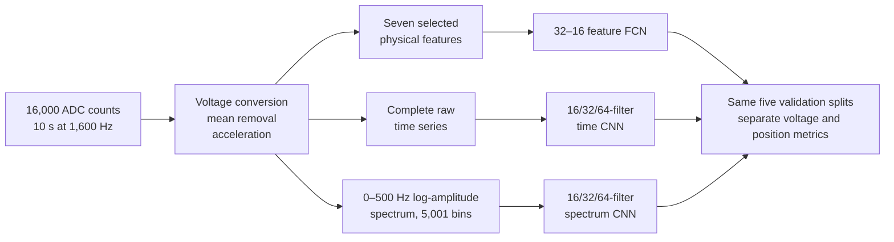
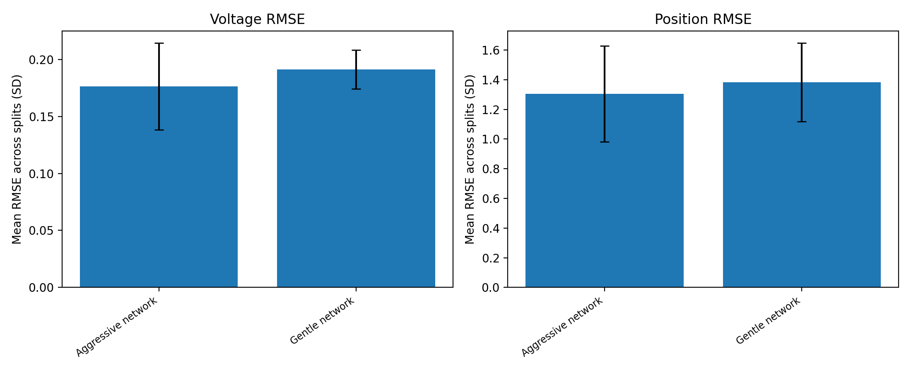
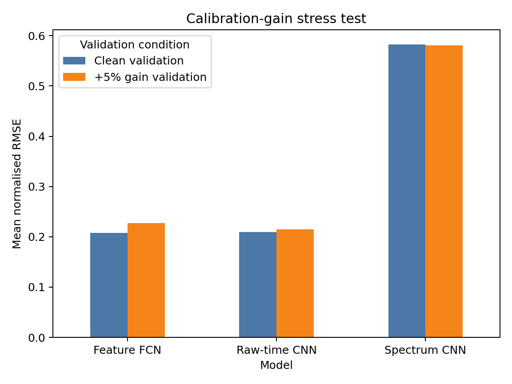

# From sampled vibration to validated predictions

The acquisition choices in the [first design](01-first-acquisition-design.md) and [lab validation](02-lab-acquisition-and-validation.md) explain why each supplied record has 16,000 ADC counts sampled at 1,600 Hz. This report follows those records through data checks, feature construction, network selection and repeated validation. The analysis used a **separately supplied** 200-record labelled dataset and 50 unlabelled test records. It does not claim that the earlier single lab trace and the later 200 records are the same experiment.

## 1. Convert and check the measurement

The assigned data are signed 16-bit containers for the ADS1015's 12-bit output at ±2.048 V. The conversion is approximately 0.001 V/count. Each record is mean-centred and converted to acceleration using **0.330 V/g, as specified for the later assignment**. The acquisition report used a typical 0.300 V/g value when discussing its earlier lab trace; that value is not silently carried into this analysis.

The 200 labelled records were checked for shape, finite values and ADC bounds. The observed counts stayed within the selected ADC range. The maximum mean-centred acceleration reached about 5.79 g, which reinforces the warning that the first report's 1.6 g estimate was not a reliable bound.

The working hypothesis was that motor voltage influences rotational speed, which appears in dominant frequency, while sensor position changes the measured response amplitude and waveform. It motivated the candidate features and the use of a raw-signal CNN, but the later feature-importance and model comparisons measure predictive associations rather than mechanical causation.

## 2. Keep three input representations comparable

The feature path computes RMS, peak-to-peak amplitude, kurtosis, a declared 20–105 Hz band peak and its amplitude, high-frequency energy ratio and spectral centroid. Crest factor was tested and removed. The raw-time CNN sees the whole mean-centred record without an FFT or engineered features. The spectrum CNN sees a one-sided, fixed 0.1 Hz grid from 0 to 500 Hz after `log1p` amplitude compression; frequency coordinates label plots but are not separate network inputs.

The largest 20–105 Hz peak correlated strongly with voltage in the supplied data. An earlier rule that automatically halved apparent second-harmonic peaks was rejected after an audit showed worse consistency on the three altered records. The retained rule is a reproducible *feature definition*, not independent proof of the mechanical fundamental.

## 3. Compare choices before selecting models

Only 200 labelled examples were available, so each choice was checked on the **same five target-aware 80/20 splits**, with seeds 53, 153, 253, 353 and 453. Every input and target standardiser was fitted on the 160 training records of each split and then applied unchanged to its 40 validation records. The hidden-label test set was not used to calculate accuracy.

| Decision | Compared alternatives | Evidence-based choice |
|---|---|---|
| Feature set | Eight candidates and ablations | Remove crest factor; mean normalised RMSE fell from 0.226 to 0.208. Removing dominant frequency raised it to 0.442. |
| Feature network size | 8–8, 32–16 and 64–32 hidden widths | Select 32–16 and 818 parameters. The 64–32 model was marginally lower at 0.202 versus 0.208 but used 2,658 parameters. |
| Time CNN sampling reduction | Aggressive versus gentler convolution/pooling | Aggressive path: 0.209 mean normalised RMSE versus 0.224 for the gentler path. |
| Time CNN training noise | Standard deviations 0, 0.01 and 0.02 | Select zero. Noise 0.01 slightly lowered the overall average but worsened voltage RMSE. |
| Spectrum global pooling | Average versus maximum | Average pooling: 0.592 mean normalised RMSE versus 0.691 for maximum under the matched no-noise control. |
| Spectrum training noise | Standard deviations 0, 0.01 and 0.02 | Select 0.01: 0.582 mean normalised RMSE; small gain relative to split variation. |

These are bounded comparisons, not a global architecture search. The [published configurations](../experiments/) and [summary evidence](../evidence/) retain the decision trail.

## 4. Final repeated-validation results

| Selected method | Parameters | Mean normalised RMSE | Voltage RMSE | Position RMSE |
|---|---:|---:|---:|---:|
| Seven-feature FCN, 32–16 | 818 | 0.208 ± 0.015 | 0.126 ± 0.009 V | 1.514 ± 0.169 cm |
| Raw-time CNN, 16/32/64 filters | 29,922 | 0.209 ± 0.042 | 0.176 ± 0.038 V | **1.305 ± 0.322 cm** |
| Spectrum CNN, 16/32/64 filters | 22,562 | 0.582 ± 0.062 | 0.509 ± 0.069 V | 3.555 ± 0.351 cm |

The feature FCN is the compact primary choice for the joint task and predicts voltage most accurately. The raw-time CNN predicts position most accurately. Their overall means are nearly tied, but the time CNN varies more across splits. The amplitude-spectrum CNN is materially weaker. The discarded phase and time ordering are a plausible contributor to its poor position results; this comparison alone does not prove the physical cause.

In a shared stress test, each held-out acceleration record was multiplied by 1.05 after training. Mean normalised RMSE changed by +0.0189 for the feature FCN, +0.0057 for the time CNN and −0.0013 for the spectrum CNN. The time CNN was more stable than the competitive feature model under **this one simulated gain change**. The spectrum model's near-invariance did not overcome its poor clean accuracy.

## 5. What “stable output” means here

It means the models were run across five fixed, comparable validation splits; their mean errors and split-to-split variation were reported; architecture and augmentation choices were checked with matched controls; and a small calibration-shift test challenged the final selection. It does **not** mean that any one exported Keras file has been externally validated on a new sensor, motor or beam.

The original public repository snapshot contained three Keras files and plots from an earlier **single random split**. They are preserved in [the historical snapshot](../archive/initial-single-split/) with their original run seed. Those weights must not be confused with the final five-split estimates above. The repeated experiments saved metrics and predictions, not one canonical trained model file per method.

## Evidence and provenance

- [Feature selection and 818-parameter FCN](../evidence/feature-fcn/) — adopted row and ablations from the corrected 70-run study.
- [Raw-time CNN](../evidence/time-cnn/) — architecture control, noise control and final five-split metrics.
- [Spectrum CNN](../evidence/spectrum-cnn/) — pooling control, noise control and final five-split metrics.
- [Shared gain stress test](../evidence/gain-stress/) — clean and +5% held-out comparison.

Source: Edmund Dai, *Data Analysis Report*, 2026 Term 2, sections 1–5; project experiment manifests and result files. The report contains figures and assignment material not reproduced in this public edition.
